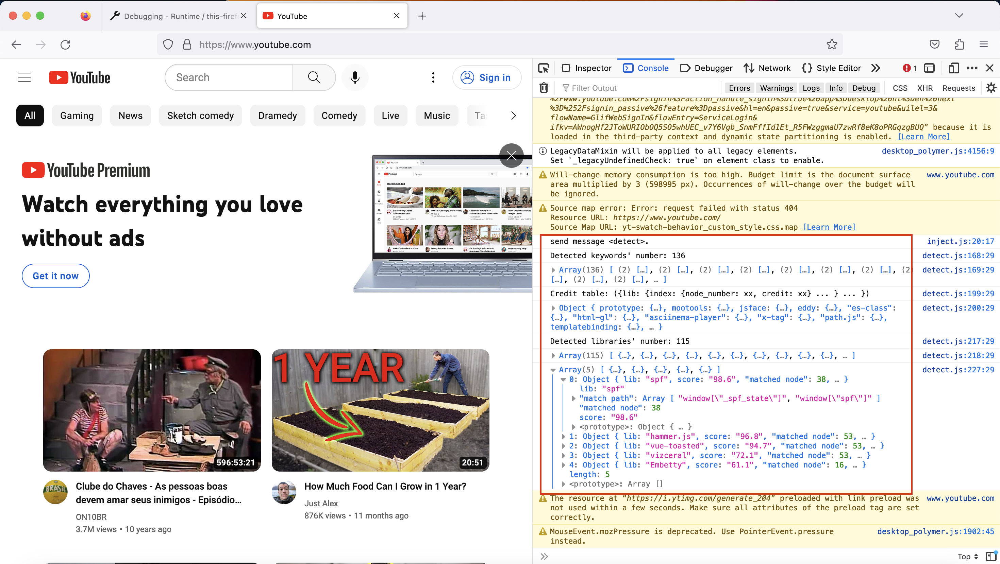

### Web Library Detector

#### What is this?

pDetector is a Chrome extension which can detect all JavaScript libraries runs behind the web. LibDetector collects over 2,000 libraries information from [cdnjs](https://cdnjs.com/). The library detection ability has academic research support.

#### How to use?

For developers: open the Chrome browser, navigate to `chrome://extensions/` site, , click the "Load Unpacked" button to load the folder. Before use, please pin it in the browser extensions menu.

In the popup, click the "detect" button. The detection result will show in the browser console (red block in the following picture). The library with higher score has larger possibility to exist (full score is 100).

